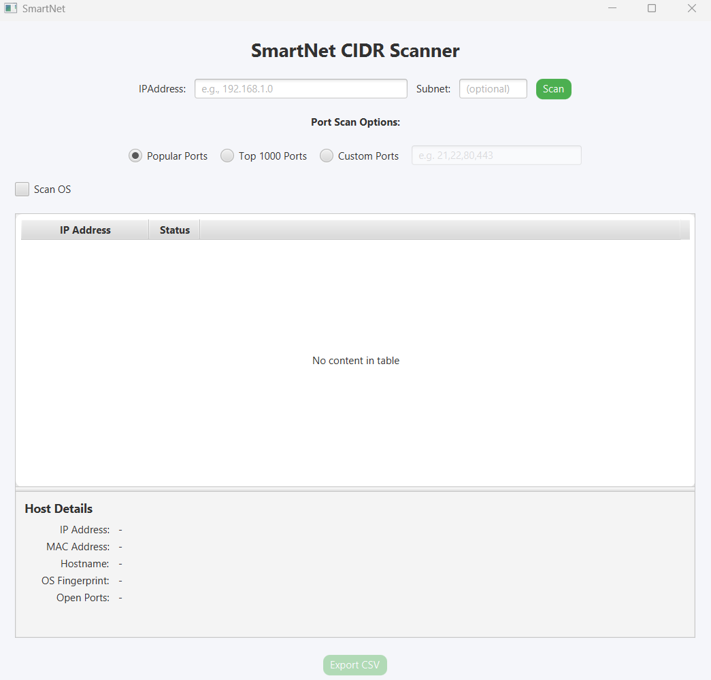
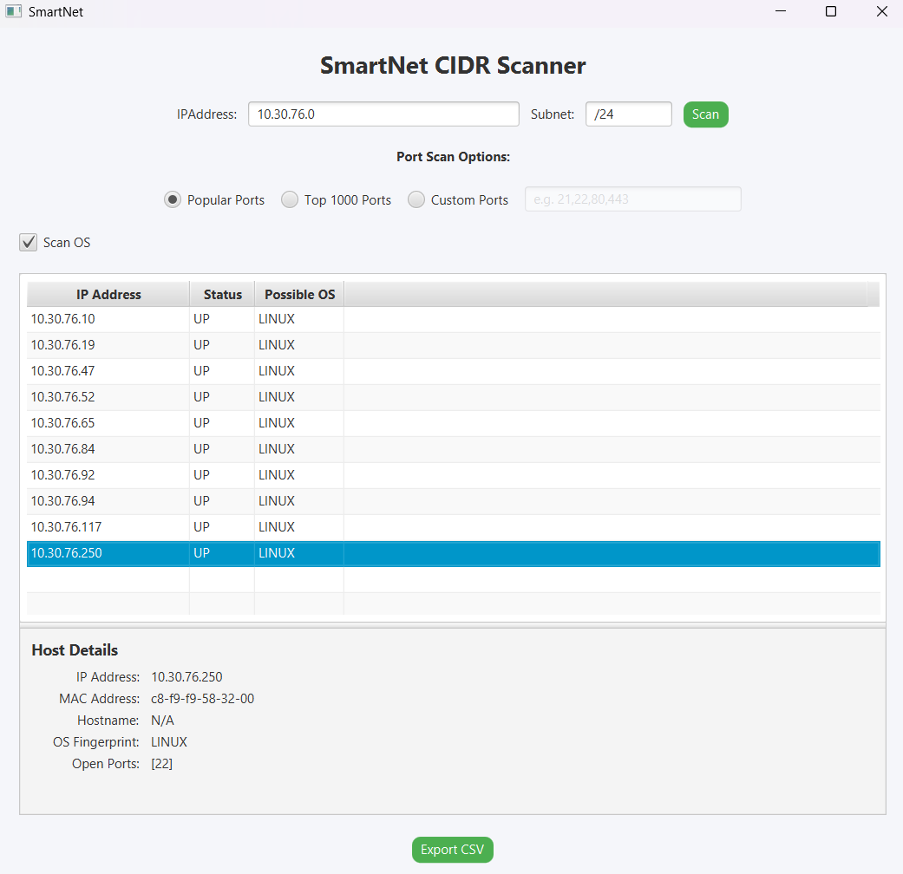

# ⚡ SmartNet

**SmartNet** is an intelligent **CIDR-based network scanner** built in **Java 20** with a sleek **JavaFX UI**.  
It enables fast subnet scanning with threaded execution and provides host information such as:

- ✅ IP reachability
- ✅ Open ports
- ✅ Hostname & MAC address (when available)
- ✅ Real-time results displayed in a JavaFX Table
- ✅ OS Fingerprinting (Optional)

---

## ✨ Features

- 🔍 **CIDR Subnet Scanning** — Scan an entire subnet (e.g., `192.168.1.0/24`) in one go
- ⚡ **Multi-threaded Execution** — Uses thread pools for faster scanning
- 🖥️ **JavaFX UI** — Clean interface with a results table
- 🔄 **Loading Overlay** — Spinner shows scan progress
- 📑 **Export Options** — Scan results can be exported (CSV planned)

---

## 🛠️ Tech Stack

| Language                                                 | UI Framework                                                                                  | Build Tool                                              |
|----------------------------------------------------------|-----------------------------------------------------------------------------------------------|---------------------------------------------------------|
|  <br>Java 20 |  <br>JavaFX | <br>Maven |

---

## 📸 Preview

>Home

>Scanning


---

## 🚀 Getting Started

### 1️⃣ Clone the Repository

```bash
git clone https://github.com/DevN1212/SmartNet.git
cd SmartNet
```

### 2️⃣ Build & Run with Maven

```bash
./mvnw clean javafx:run
```
---
